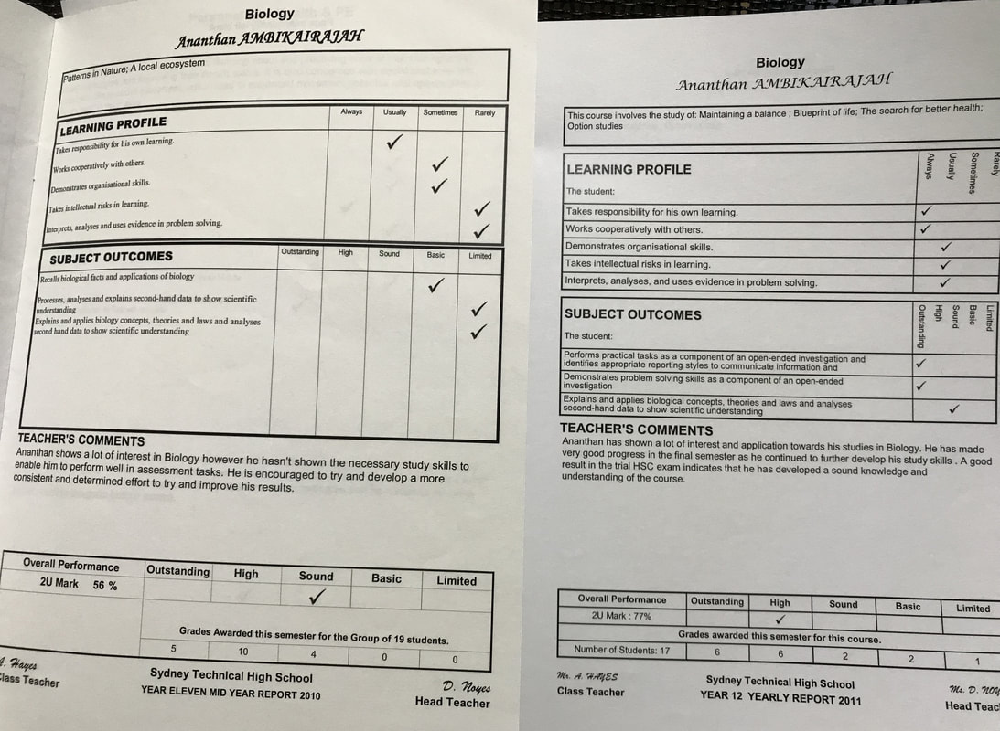

When I teach students, I take the same level of responsibility, care and commitment towards their learning and development as I would hope another teacher would show my future children. This can, at times, be emotionally arduous, when such a heavy investment is put into relationships that are inherently transient with every calendar year. However, the immense joy in seeing the professional and personal development of my students is what motivates me to keep working on my craft.    

This mindset can lead to discussions with students that extend beyond the classroom and focus on life after school/university. Despite the countless number of students that I have taught or even spoken to after delivering a speech, there are common patterns that have emerged in the questions that are asked, with the most common question being:    

What career should I choose?    

It is a big question and an even bigger one to answer.    
My first piece of advice is to “never listen to anyone’s advice”. Inherently, all advice is somewhat biased by personal experience and may not translate to another situation. Those of you that are perceptive, however, will realise that this piece of advice is a trap in itself, because by following this mantra, you are in fact breaking it. What I hope students take from this is to listen to everyone (especially those that care the most about you), but ultimately, back yourself and your decisions. If you make a mistake, good! Fail early, fail often and fail forward.    

With that being said, the next thing I say is to realise that passions are developed through hard work - they are not instantaneously created. If you are passionate about something now, there is a high likelihood that you practiced a skill that is integral to that passion, even if you are unaware of that skill as being important. For example, whilst I am passionate about teaching, I believe that it is the years and years of public speaking practice that I did as a child, which sparked this passion. My mum would make me rehearse speeches over and over and over until they were memorised word for word. Then she taught me how to project my voice. Then she taught me how to use hand gestures to engage an audience. The list goes on and on. I was forcibly entered into every public speaking competition in primary school that was available and the process of winning a few of those competitions created the building blocks for passion. When I was in high school, I put myself in positions to continually practice this skill by speaking at assemblies and working hard on the yearly English speeches. In university, I worked on campus as a radio presenter, then started doing stand up comedy, which then led to other public speaking events and finally, teaching.    

The important thing to note here is that I have taken this mindset towards all aspects of my life, which is why I am such a big advocate for developing a strong work ethic over following your passion, because passion follows work ethic.    

Let me give you one final example. When I was in Year 8 I remember that on my yearly report card I received a “D” for science. The only grade lower than this was an “E” which was reserved for students who either did not attend school or did not hand in any assessment tasks. I distinctly remember saying to myself “I can’t wait until I am in Year 11 and I can drop science!” Fast forward the clock to Year 10 subject selections and parental pressure ensured that I did Biology and Chemistry. I was adamant on dropping Biology, however, as this clashed with my favourite subject, Drama. My previous work ethic for developing my public speaking skills had already provided me with an aptitude for Drama classes. As a result, I had meeting after meeting with the Deputy Principal to try and balance my schedule to do both. I could not. Reluctantly, I chose Biology.    

Rather than being upset with this decision, I instead focused my energy on doing the best I could at Biology. My Year 11 report card shows the difficulty I experienced when all of my hard work on the subject led to a disheartening mark of 56%. I proceeded to work and work and work on the subject. Fast forward again to the end of year 12 and after years of practice, my final report card mark for Biology was 77%. It wasn’t amazing but it was progress and I was even starting to find Biology interesting. I also realised through this process that hard work was the answer to passion development. I ended up picking science in university and obtained a distinction average for my degree and published 2 papers in scientific journals whilst I was an undergraduate student. I became a science teacher, where I taught students the same subject that I was weakest at in high school. My hard work turned an undesirable course into a passion, which led me to where I am now, a PhD Candidate in Neuroscience at the Australian National University in Canberra.    

Are there other career paths out there for me that I would be better suited for? It is not only possible, but it is in fact highly likely. Whilst I am extremely passionate about teaching, research has always been an avenue for me to develop my skills and become a better teacher (i.e. the more I know, the more I can help my students).  In saying that, I started my PhD this year and I am putting in 60-70 hour workweeks. Multiply that across 4 years and I am very confident that I will be an extremely passionate researcher by the end of this process.    

You don’t necessarily have to be able to see the bigger picture, in order to be able to start working towards it. Pick a direction, set goals, work hard, and personal progress will allow for opportunities to develop. Don’t follow your passions, foster them with a strong work ethic. 