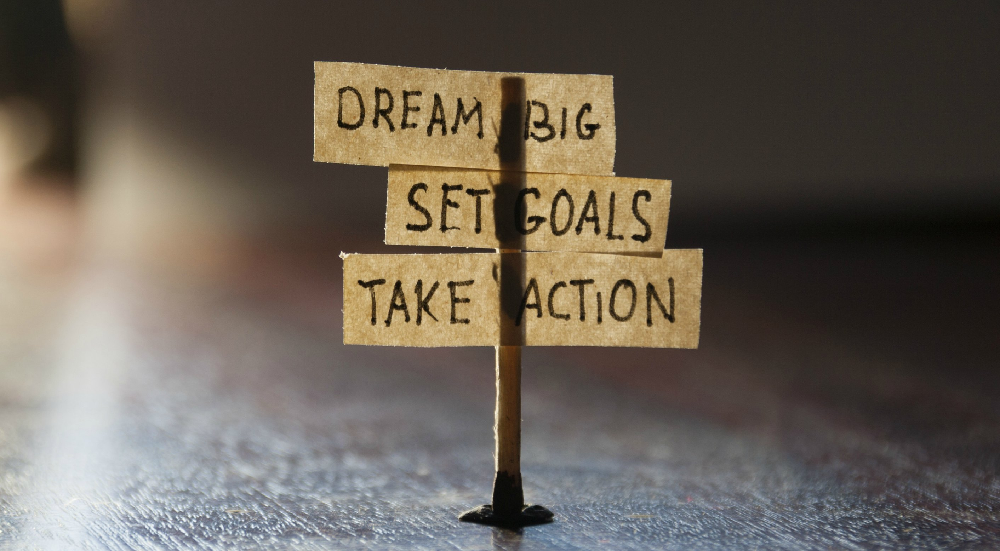

August marks my 6-month milestone since commencing a PhD program. As a result of this significant milestone, I thought I would use this week’s blog post to reflect on the journey so far.    

When I think about what skill has helped me get to this point, two words immediately spring to mind.    

Work ethic.    

As a PhD student you are largely in control of your own schedule and you can direct your own hours. This can be empowering for some but overwhelming for others. It is very easy to keep preoccupied with “productive procrastination”, which essentially means working on tasks that feel like work, but are really distractions or low priority items that direct your focus away from your main goal i.e. me writing this blog post is a perfect example of a productive procrastination task.    

In saying this, however, I have found that the autonomy of a PhD schedule suits me well as I can still engage in activities that I am passionate about, such as teaching and science communication. As long as the work gets done, my “work time activities" are never questioned. In fact, I took two hours off work earlier in the week to go to the gym…but I will come back to this in a second.    

Evidently, a strong work ethic is a key skill to develop when learning how to thrive in a highly autonomous environment. The question then becomes, how does one develop a work ethic?    

Here are a few key things that have helped me.    

1) Create a focus/vision.    

Understand what you want and more importantly WHY you want it. If you are not sure what you want, don’t worry. Focus on the next few tips instead, as your vision can be shaped over time with experience. The most important thing right now is that you pick a direction (any direction!) and go.    

2) Learn the core principles of goal setting.    

Goal setting is the tool, which can help you bridge the gap between the unattainable and the attainable. Most people who start writing down their goals usually aim for things that are either too general, irrelevant to their main focus, too difficult or some combination of the above. I am definitely guilty of this as evident by a guitar that has been sitting in my room, which has hardly been touched for the past 3 years. Therefore it is important to note that goal setting is a skill in itself, which you become better at utilising and implementing with continual practice.    

3) Learn that failing can be fun.    

When you shift your mindset to start viewing failures as an opportunity to continually learn and develop, it can help shape a positive perspective on difficult goals. This can be easier said then done.    

When I was doing stand up comedy regularly, I had an opportunity to get to know Australian Comedian Sammy J. His advice for me was to try new things and enjoy the early days because that is when you could fail over and over with hardly anyone watching. I soon realised that the reason why it is difficult to develop a positive relationship with failure is because there are usually consequences associated with failing, which become bigger as your notability and levels of responsibility increases. It is important to note, however, that the path to developing discipline is inherently difficult and filled with failure. Acknowledging this and integrating a positive perspective about failure into your foundation can be key to learning how to deal with the consequences of failing at any level.   

4) Don’t be too tough on yourself when you don’t achieve a goal.    

This is a lesson that I am still learning and working on. I have found that in some situations, it can be good to scale back goals, however, in other situations, the goals that you fail forward on multiple times can set you up for a euphoric feeling of success. Once again, understanding this balance comes with practice (notice a common theme here?).    

5) Reward yourself when you achieve a goal.    

When I was younger I had extreme difficulty with focusing, especially when it came to reading. Whilst this was a weakness that I could get away with in high school (thank you SparkNotes…), the demands of university quickly exposed this. As a result, I would set small goals and reward myself for achieving those goals. This involved sitting down to read one page of a book. After several sittings, I would increase the threshold to 2 pages, then 3, then 4, and so on and so forth. Each time I achieved this goal I rewarded myself with something I enjoyed. To this day, I still do this. I mentioned that I took a few hours to go to the gym earlier in the week. Exercise has become a luxury in my current life and I used it as a reward after I had completed an extremely arduous task for my PhD. In saying that, I also find that it is useful to penalise myself when a goal is not met. This gives more weight and meaning when a goal is achieved.    

6) Show me your friends and I’ll show you your future.    

I love this quote, mostly because it emphasises that your environment can strongly influence your behaviours. Why is this relevant to developing a strong work ethic? Well, if you are the hardest working person in the room, then you are probably in the wrong room. Surround yourself with people that have qualities you admire and at the very least, you can observe what a life is like when those qualities are practiced.    

At the end of the day, there are a number of ways that a work ethic can be fostered and developed, but I hope that this article provides a useful perspective on some tools that can help. In saying this, I know that there can be a lot of confusion when it comes to developing a strong work ethic, so a core message that I want to leave this article with is that people are commended in public for the hours and hours of practice that they do in private. At the end of the day, it's all about practice. 