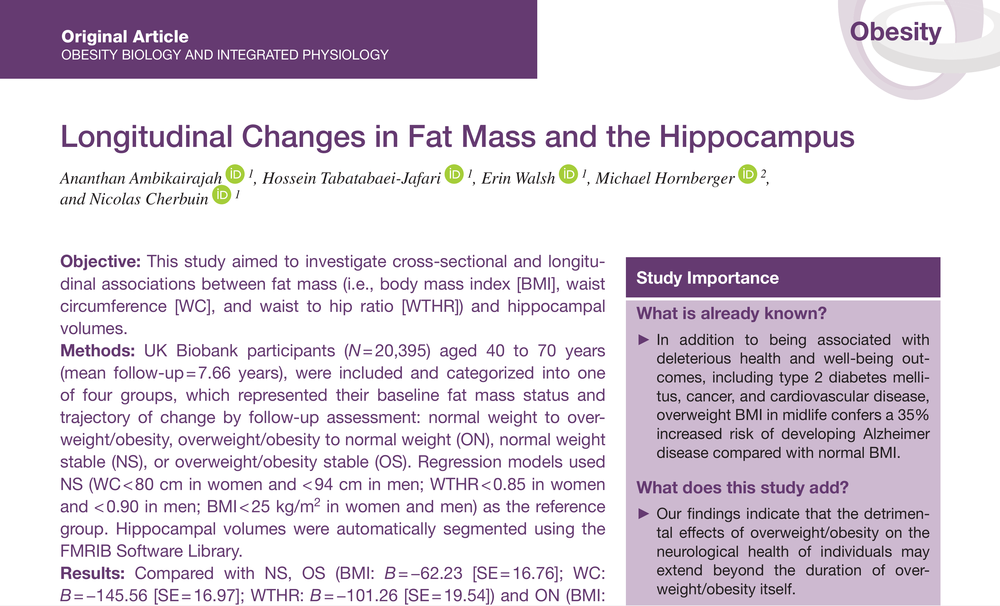

Researchers have found a link between obesity and shrinkage in an area of the brain responsible for memory and learning - the hippocampus.  

The hippocampus is the part of the brain impaired in the early stages of Alzheimer's disease, with the study's findings shedding new light on the possible drivers of the disease. 

The researchers analysed brain scans from more than 20,000 healthy men and women aged between 40 and 70 years and found smaller hippocampus volumes in those who either currently or previously carried excessive weight or suffered from obesity.

"We examined the link between fat mass and the brain because previous research has shown that having excessive fat mass in midlife can increase the risk of developing Alzheimer's disease by 35 percent," Mr Ananthan Ambikairajah, a PhD scholar from The Australian National University (ANU), said. 

"We found that people who suffered from obesity or carried excessive weight had a smaller hippocampus than those who maintained a normal weight." 

Mr Ambikairajah says the findings, emphasise the importance of maintaining a normal weight for brain health. 

"It was surprising to find that people who suffered from obesity or carried excessive weight in the past, but currently had a normal level of fat mass, also had a smaller hippocampus than those who always maintained a normal weight," he said. 

"The hippocampus is one of the few regions that actually continues to form new cells as you get older and is often the first area of the brain to be impacted by Alzheimer's disease.  

"This study shows just how important it is to maintain a healthy amount of fat mass throughout life for both men and women." 

The study has been published in Obesity. The full study can be found [here](https://onlinelibrary.wiley.com/doi/abs/10.1002/oby.22819).

**Citation:**    
**Ambikairajah, A.**, Tabatabaei-Jafari, H., Walsh, E., Hornberger, M., & Cherbuin, N. (2020). Longitudinal changes in fat mass and the hippocampus. *Obesity*. [doi:10.1002/oby.22819](https://onlinelibrary.wiley.com/doi/abs/10.1002/oby.22819)