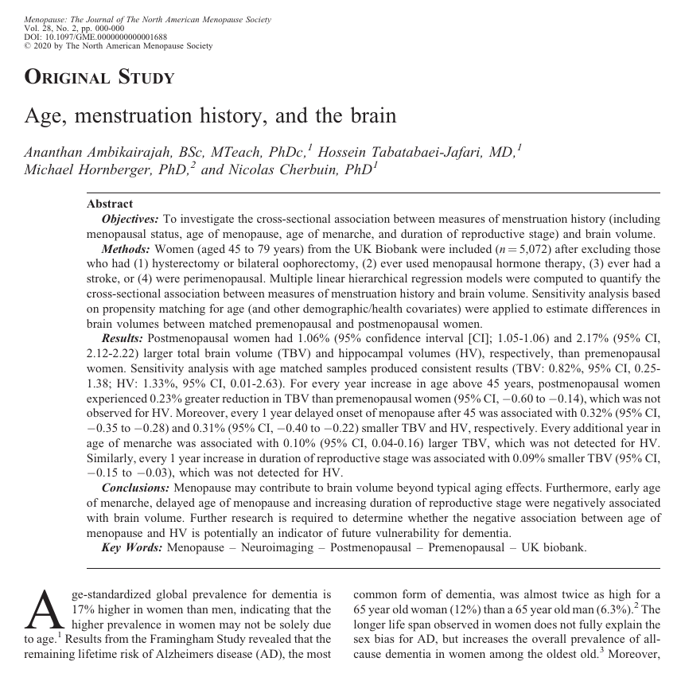

During his PhD research, Ananthan Ambikairajah appeared in the media a number of times to report on his findings about the effects of menopause.

It was never good news.

Memorable headlines included: "Women have higher 'bad cholesterol' after menopause"; "As the belly expands with age, the memory may shrink"; and "Menopause shifts fat to waistline".

Ananthan attempted a positive spin on this last story—about large waistlines—saying his research showed you can't actually blame menopause for weight gain.

Instead, you can blame ageing for weight gain. Menopause is likely only responsible for weight redistribution. To the belly. It doesn't seem that positive.

"I definitely get that it may not seem like an empowering message," he says. "But actually, it is, because it emphasises the need to focus on preventative strategies for women’s health."

Ananthan is about to conclude his PhD at the Neuroimaging and Brain Lab with the ANU Research School of Population Health, but he has one more finding to report before then. You're forgiven for bracing for more bad news.

"It's an interesting finding," Ananthan says. "We found that postmenopausal women in fact had larger brain volumes than premenopausal women."

So the belly and the brain increase?

"Yes, but with the brain, we generally assume it's a good thing," Ananthan explains. "However, there are cases where it can be bad. More research is required to clarify which of these two possibilities it is in this context.”

What Ananthan is saying, finally, is that menopause may have some positive health implications.

"There could be a silver lining here. There are undesirable physiological changes in fat mass and cholesterol, but there may be positive effects on the brain, in terms of brain volume."

He pauses.

"But we just don't know what those effects are right now and whether they translate to functional benefits."

Demonstrating that menopause changes the brain is an important finding, and one backed up by data taken from over 5000 brain scans. However, it opens up many more questions for future research.

"What does it really mean to have larger brain volume?" Ananthan asks. "Generally, it is an indicator of better brain health, but not always. In this context, more research needs to be done.

"It's so important because we're all living so much longer. The average age of menopause is around 46 to 52, and for women, life expectancy is 85. So that means about 40 percent of a woman's life is living in this postmenopausal period.

"It's a significant life event that needs more focus. We need to know how it interacts with other health outcomes. Women's health, generally, is such an under-researched area."

Many women agree. Whenever his research has received media coverage, Ananthan says he receives emails from women wanting to share their personal experiences or find out more about the science.

"The field of research I'm in is data-driven, so it's important to me that I can have that contact and tailor my research to the needs of the public. These interactions motivate me and help give me new ideas for research.

"People let me know how things have gone with their mum or themselves and more often than not, I just listen, or if I can help, I tell them what I know that's grounded within research.

"More than anything, it's just lots of people who are happy to know research is being done on menopause."

Because when it comes to understanding women's health, what we need is more information. We'll take the good and the bad.

The study has been published in Menopause. The full study can be found [here](https://journals.lww.com/menopausejournal/Abstract/9000/Age,_menstruation_history,_and_the_brain.97065.aspx).

**Citation:**    
**Ambikairajah, A.**, Tabatabaei-Jafari, H., Hornberger, M., & Cherbuin, N. (2020). Age, menstruation history, and the brain. *Menopause*.